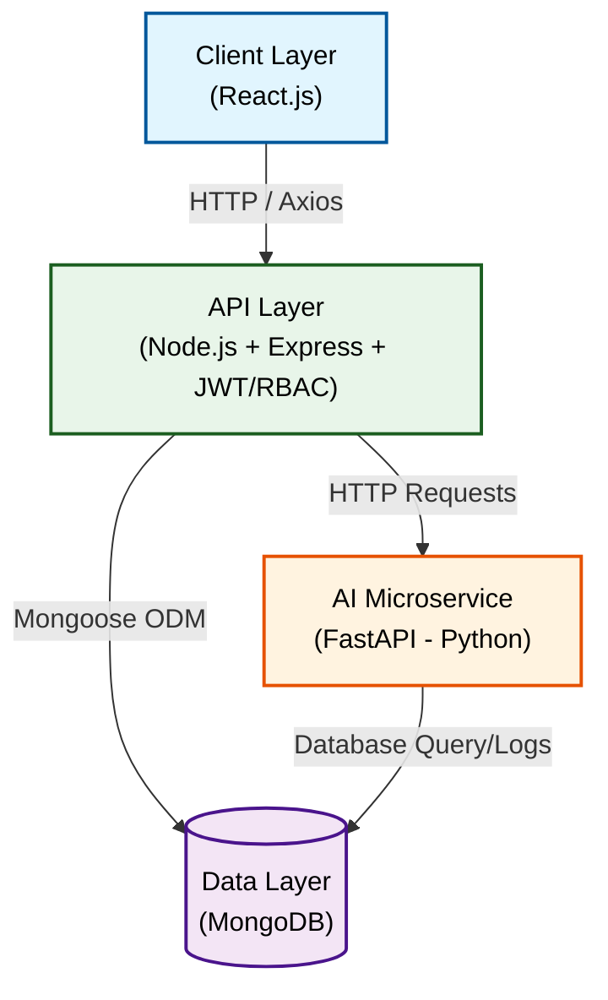

<div align="center">

<br />

<pre>
████████╗██████╗  █████╗  ██████╗███████╗ ██████╗  ██████╗ ██╗   ██╗
╚══██╔══╝██╔══██╗██╔══██╗██╔════╝██╔════╝██╔════╝ ██╔═══██╗██║   ██║
   ██║   ██████╔╝███████║██║     █████╗  ██║  ███╗██║   ██║██║   ██║
   ██║   ██╔══██╗██╔══██║██║     ██╔══╝  ██║   ██║██║   ██║╚██╗ ██╔╝
   ██║   ██║  ██║██║  ██║╚██████╗███████╗╚██████╔╝╚██████╔╝ ╚████╔╝
   ╚═╝   ╚═╝  ╚═╝╚═╝  ╚═╝ ╚═════╝╚══════╝ ╚═════╝  ╚═════╝   ╚═══╝
</pre>

### QR-Based Government File Tracking System

**Track. Verify. Deliver.**

<br />

[](https://react.dev)
[](https://nodejs.org)
[](https://mongodb.com)
[](https://fastapi.tiangolo.com)
[](LICENSE)

<br />

</div>

---

## Overview

**TraceGov** is a full-stack web application designed to digitize and streamline government document management, enhancing **transparency and accountability** in public administration. Each document is assigned a unique **QR code** for real-time tracking across departments, eliminating manual handoffs and lost files.

The system provides **role-based access**, **OCR-powered document reading**, and an **AI microservice** that detects bottlenecks in the document flow — giving administrators data-driven insight into departmental efficiency.

> Built as a minor project at **Cosmos College of Management and Technology**, affiliated with Pokhara University.

---

## Features

| Feature | Description |
|---|---|
|  **Auth & RBAC** | JWT-based login with role-based access (Admin, Staff, Viewer) |
|  **Document Management** | Create, update, and manage official documents |
|  **QR Code Tracking** | Each document gets a unique QR — scan to update status & location |
|  **OCR Processing** | Extract text from scanned/uploaded documents automatically |
|  **Bottleneck Detection** | AI microservice identifies slow departments in document flow |
|  **Tracking History** | Full audit trail — who scanned, when, and where |
|  **Dashboard** | Real-time stats, recent activity, and department reports |

---

## Architecture



---
<!-- for now hidden
## Project Structure

```
TraceGov/
├── frontend/                  # React.js
│   ├── src/
│   │   ├── components/        # Reusable UI components
│   │   ├── pages/             # Route-level pages
│   │   ├── hooks/             # Custom React hooks
│   │   ├── services/          # Axios API calls
│   │   ├── context/           # Auth context / global state
│   │   └── utils/             # Helper functions
│   └── .env                   # REACT_APP_API_URL, REACT_APP_AI_URL
│
├── backend/                   # Node.js + Express
│   ├── controllers/           # Route handler logic
│   ├── routes/                # Express route definitions
│   ├── models/                # Mongoose schemas
│   ├── middleware/            # Auth, RBAC, error handling
│   ├── utils/                 # JWT helpers, validators
│   └── .env                   # PORT, MONGO_URI, JWT_SECRET
│
├── ai-service/                # Python FastAPI
│   ├── routes/                # OCR, QR, bottleneck endpoints
│   ├── services/              # Core logic (pytesseract, qrcode)
│   ├── models/                # Pydantic schemas
│   └── .env                   # MONGO_URI, PORT
│
└── README.md
```

---

## 🗄️ Database Schemas

### User
```js
{
  name:         String,
  email:        String (unique),
  password:     String (bcrypt hashed),
  role:         "admin" | "staff" | "viewer",
  department:   ObjectId → Department,
  createdAt:    Date
}
```

### Document
```js
{
  title:            String,
  description:      String,
  status:           "pending" | "in-transit" | "received" | "completed",
  currentLocation:  String,
  createdBy:        ObjectId → User,
  department:       ObjectId → Department,
  qrCode:           String (base64),
  ocrText:          String,
  trackingHistory:  [ObjectId] → TrackingLog,
  createdAt:        Date,
  updatedAt:        Date
}
```

### TrackingLog
```js
{
  documentId:   ObjectId → Document,
  scannedBy:    ObjectId → User,
  location:     String,
  status:       String,
  note:         String,
  timestamp:    Date
}
```

---

## 🔌 API Endpoints

### Auth
```
POST   /api/auth/register      Register new user
POST   /api/auth/login         Login → returns JWT token
GET    /api/auth/me            Get current user (token required)
```

### Documents
```
GET    /api/documents          Get all documents (paginated)
POST   /api/documents          Create new document + generate QR
GET    /api/documents/:id      Get document details
PATCH  /api/documents/:id      Update document
DELETE /api/documents/:id      Delete document (admin only)
POST   /api/documents/:id/scan Scan QR → update status/location
GET    /api/documents/:id/history  Full tracking history
```

### AI Microservice (FastAPI — port 8000)
```
POST   /ocr                    Upload image → extract text
POST   /qr/generate            Generate QR code for a document
GET    /bottleneck             Analyze logs → detect slow departments
```

> All responses follow: `{ success: true/false, data: {...}, message: "..." }`

---
-->
<!--
## Getting Started

### Prerequisites

- Node.js v18+
- Python 3.10+
- MongoDB (local or Atlas)
- Tesseract OCR installed on system

---

### 1. Clone the repo

```bash
git clone https://github.com/Sudeeppp-Mishra/TraceGov.git
cd TraceGov
git checkout dev
```

---

### 2. Frontend

```bash
cd frontend
npm install
cp .env.example .env        # fill in your values
npm start                   # runs on http://localhost:3000
```

**`.env` variables:**
```env
REACT_APP_API_URL=http://localhost:5000/api
REACT_APP_AI_URL=http://localhost:8000
```

---

### 3. Backend

```bash
cd backend
npm install
cp .env.example .env        # fill in your values
npm run dev                 # runs on http://localhost:5000
```

**`.env` variables:**
```env
PORT=5000
MONGO_URI=mongodb://localhost:27017/tracegov
JWT_SECRET=your_jwt_secret_here
JWT_EXPIRES_IN=7d
```

---

### 4. AI Microservice

```bash
cd ai-service
python -m venv venv
venv\Scripts\activate       # Windows
source venv/bin/activate    # macOS/Linux
pip install -r requirements.txt
cp .env.example .env        # fill in your values
uvicorn main:app --reload   # runs on http://localhost:8000
```

**`.env` variables:**
```env
MONGO_URI=mongodb://localhost:27017/tracegov
PORT=8000
```

---
-->
<!--
## Team

| Member | Role |
|---|---|
| Sudeep Mishra | Frontend — React.js, UI/UX |
| Member 2 | Backend — Node.js, Express, JWT |
| Member 3 | Database — MongoDB, Mongoose Schemas |
| Member 4 | AI Service — FastAPI, OCR, QR Generation |

---
-->
<!--
## Git Workflow

```
main     ← stable, production-ready only
dev      ← active development, all PRs merge here
feature/ ← individual feature branches
```
-->
<!--
```bash
# Start a new feature
git checkout dev
git pull origin dev
git checkout -b feature/your-feature-name

# Push and open PR into dev
git push origin feature/your-feature-name
```

---
-->
## License

This project is licensed under the [MIT License](LICENSE).

---
